# Alloys Dashboard - Docs

## Context diagram

```mermaid
graph RL

    %% System actors
    User(("👤<br>User")):::actor

    %% System - Use case container
    subgraph System["Alloys Dashboard"]
    end

    %% Interactions
    User -- UI Interactions --> System
    System -- Data --> User

    %% Style
    classDef actor stroke:none,fill:none,font-size:20px
```

## Use Case diagram

```mermaid
graph LR

    %% System actors
    User(("👤<br>User")):::actor

    %% System - Use case container
    subgraph "Alloys Dashboard"

        space[ ]:::hide

        UC1([List filtered alloys])

        UC_FILTER([Filter alloys])
        UC_COMP([Visualize compositions])

        UC_COMP -. "<span><< Extend >></span>" .-> UC1
        UC1 -. "<span><< Include >></span>" .-> UC_FILTER
    end

    %% Relationship
    User ---> UC1


    %% Style
    classDef hide display:none;
    classDef actor stroke:none,fill:none,font-size:20px
```

## High-level view

```mermaid
graph LR

    %% System actors
    User(("👤<br>User")):::actor

    %% System - Use case container
    subgraph "Alloys Dashboard"
        
        %% Internal components
        NEXT["<b>SPA</b><br/>(React)"]
        API["<b>REST API</b><br/>(.NET / C#)"]
        Database[("<b>Database</b><br/>(SQLite)")]
        
        %% Internal dataflow
        API -- "SQL" --> Database
    end

    %% Interactions
    User -- "UI interactions" --> NEXT
    NEXT -- "HTTPS Request" --> API
    API -- "HTTPS Response (JSON)" --> NEXT
    NEXT --> User

    %% Style
    classDef actor stroke:none,fill:none,font-size:20px
```

## Detailed view - SPA (React)

## Detailed view - REST API (.NET / C#)

```mermaid
graph LR

    %% System actors
    SPA(("👤<br>SPA")):::actor
    Database[("<b>Database</b><br/>(SQLite)")]

    %% REST API subsystem follows Clean Architecture principles
    subgraph "REST API (.NET / C#)"
        
        %% Api Layer
        subgraph "Api Layer"
            Controllers["<b>Controllers</b><br><small>HTTP Endpoints</small>"]
        end

        %% Application Layer
        subgraph "Application Layer"
            UseCases["<b>Use Cases</b><br><small>Business Logic</small>"]
            RepoInt["<b>Repository Interfaces</b><br><small>Abstractions</small>"]
            DTOs["<b>DTOs</b><br><small>Request/Response Objects</small>"]
            DI_Application["<b>Dependency Injection</b>"]
        end

        %% Domain Layer
        subgraph "Domain Layer"
            Models["<b>Models</b><br><small>Core Data Structure</small>"]
            Exceptions["<b>Exceptions</b>"]
        end

        %% Infrastructure Layer
        subgraph "Infrastructure Layer"
            DbContext["<b>EF Core</b><br><small>DbContext</small>"]
            RepoImpl["<b>Repository Implementations</b><br><small>Data Access</small>"]
            DI_Infrastructure["<b>Dependency Injection</b>"]
        end

    end

    %% Interactions
    SPA -- "HTTPS Request" --> Controllers
    Controllers -- "HTTPS Response (JSON)" --> SPA
    Controllers <-- "DTOs" --> UseCases
    RepoImpl -- Manipulate --> Models
    UseCases <-- "Models" --> RepoInt
    UseCases -- Mapping --> Models
    RepoInt -. "Implemented by" .-> RepoImpl
    RepoImpl  --> DbContext
    DbContext -- "SQL" --> Database

    %% Style
    classDef actor stroke:none,fill:none,font-size:20px
```

## Class diagram

## Dynamic view
