# Alloys Dashboard - Docs

## Context diagram

```mermaid
graph RL

    %% System actors
    User(("👤<br>User")):::actor

    %% System - Use case container
    subgraph System["Alloys Dashboard"]
    end

    %% Interactions
    User -- Requests --> System
    System -- Data --> User

    %% Style
    classDef actor stroke:none,fill:none,font-size:20px
```

## Use Case diagram

## High-level view

```mermaid
graph LR

    %% System actors
    User(("👤<br>User")):::actor

    %% System - Use case container
    subgraph "Alloys Dashboard"
        
        %% Internal components
        NEXT["<b>SPA</b><br/>(Next.js)"]
        API["<b>REST API</b><br/>(Python FastAPI)"]
        Database[("<b>Database</b><br/>(MSSQL)")]
        
        %% Internal dataflow
        API -- "SQL" --> Database
    end

    %% Interactions
    User -- "UI interactions" --> NEXT
    NEXT -- "HTTPS Request" --> API
    API -- "HTTPS Response (JSON)" --> NEXT
    NEXT --> User

    %% Style
    classDef actor stroke:none,fill:none,font-size:20px
```

## Detailed view - SPA (Next.js)

## Detailed view - REST API (Python FastAPI)

## Class diagram

## Dynamic view
